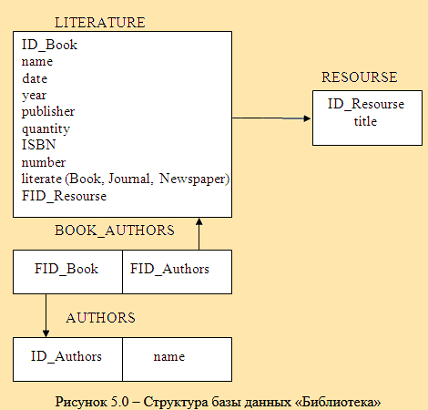
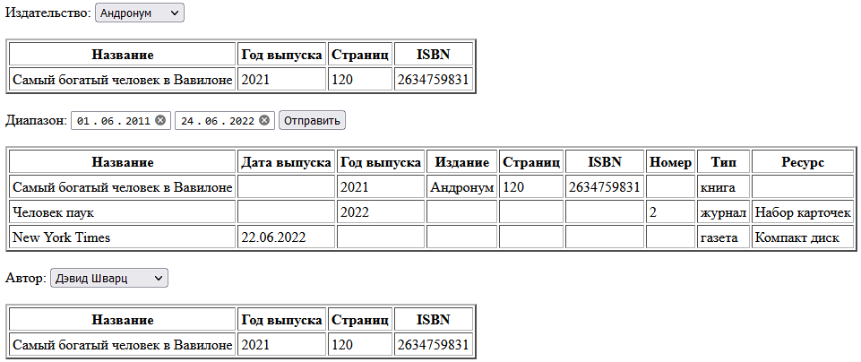

# Лабораторная работа №3
Медведчук Константин КИУКИу-20-2, Вариант 0

### Техническое задание
Создать и заполнить произвольными данными БД для хранения информации об информационных ресурсах библиотеки (Рисунок 5.0)

Различают 3 вида ресурсов: книги, журналы, газеты. Книги характеризуются названием, уникальным номером (ISBN), издательством, годом издания, количеством страниц. У книги может быть произвольное количество авторов. Журналы характеризуются названием, годом выпуска, номером. Газеты характеризуются названием и датой выхода (день, месяц, год). Книги и журналы могут содержать дополнительные информационные ресурсы (например, компакт-диски), которые учитываются и регистрируются отдельно.

Сформировать запросы, которые будут выводить на экран информацию о:

- книгах указанного издательства;
- книгах, журналах и газетах, опубликованных за указанный временной период (учитывать год издания);
- книгах указанного автора.

## Скриншоты

